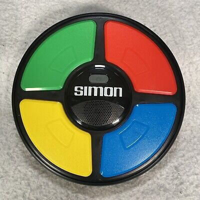
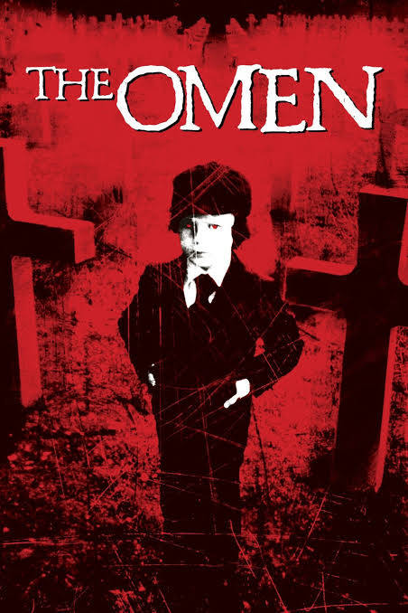

# Damien Declares

 Simon Says clone for Halloween - *do Damien's bidding or feel his wrath!*

 ## Style references:

 Color palette: [Vegetable Rainbow](https://www.color-hex.com/color-palette/1051883)\
 Font pack: [Emily's Candy](https://fonts.google.com/specimen/Emilys+Candy), [Orbitron](https://fonts.google.com/specimen/Orbitron)\
 Interface reference images:\
  \

 ## Other resources:

 Sound FX: Made on [jsfxr](https://sfxr.me)\
 Background Track: [Ave Satani - Bandcamp](https://deadlennon.bandcamp.com/track/intro-ave-satani)\
 Promise objects: [MDN](https://developer.mozilla.org/en-US/docs/Web/JavaScript/Reference/Global_Objects/Promise)\
 Asynchronous callbacks: [Callback Hell](http://callbackhell.com)